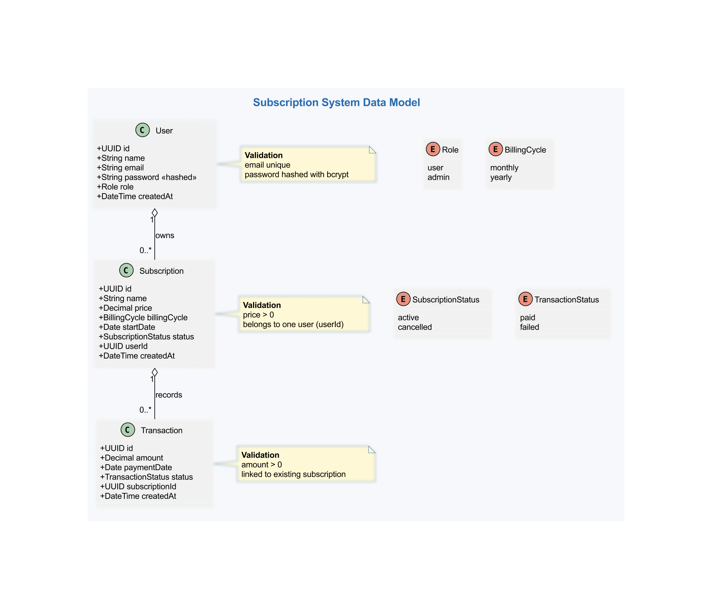

# SubLedger_v2
This is a simple subscription mangement API built using NodeJS, Express and MongoDB. It allows you to create, read, update and delete subscriptions.
users and admins are authenticated using JWT tokens. Admins can manage users while users can only manage their own subscriptions.

## UML Diagram


</div>

## Installation
1. Clone the repository
2. Install dependencies using `pnpm install or npm install`
3. Create a `.env` file in the root directory and add the following environment variables:
```.env
MONGODB_URI=your_mongodb_uri
MONGO_DB_NAME=your_database_name
JWT_SECRET=your_jwt_secret
JWT_EXPIRES_IN=your_jwt_expiration_time (default is 1h)
PORT=your_port_number
```
4. Start the server using `pnpm dev or npm run dev`

